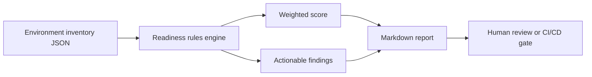

# Power Platform Environment Readiness Checker

A lightweight governance-as-code tool that scans a Power Platform environment inventory and creates a release-readiness report.

This portfolio project demonstrates solution architecture, Power Platform governance, ALM, security, compliance, and operational readiness.

## What it checks

- Environment type and production isolation
- Dataverse audit logging
- Data Loss Prevention (DLP) policy assignment
- Managed solutions in production
- Service-account ownership for automated flows
- Connection references and environment variables
- Backup and disaster-recovery readiness

## Quick start

Python 3.10+ is the only requirement.

```bash
python -m readiness_checker sample/environment.json
```

The command writes `readiness-report.md` and exits with:

- `0` when the environment is ready
- `1` when warnings exist
- `2` when critical findings exist

Try a strict CI/CD quality gate:

```bash
python -m readiness_checker sample/environment.json --fail-on warning --output report.md
```

Run the tests:

```bash
python -m unittest discover -s tests -v
```

## Example result

```text
Environment: Contoso Production
Readiness score: 50/100
Critical: 3 | Warning: 1 | Passed: 5
Report: readiness-report.md
```

## Inventory format

The input is intentionally vendor-neutral JSON so the checker is easy to demo without a tenant. In a real implementation, the same structure can be populated from the Power Platform Admin Center APIs, the CoE Starter Kit, or an Azure DevOps export step.

```json
{
  "name": "Contoso Production",
  "type": "production",
  "audit_enabled": true,
  "dlp_policy": "Enterprise Production",
  "backup_enabled": true,
  "solutions": [{"name": "Case Management", "managed": true}],
  "flows": [{"name": "Case Escalation", "owner_type": "service_account"}],
  "connection_references": [{"name": "shared_dataverse", "configured": true}],
  "environment_variables": [{"name": "ApiBaseUrl", "has_current_value": true}]
}
```

## Architecture



## Good next enhancements

1. Add Microsoft Power Platform API authentication.
2. Export findings to Power BI or Application Insights.
3. Add organization-specific HIPAA, PCI-DSS, or GDPR rule packs.
4. Publish the checker as an Azure DevOps pipeline task.

## Portfolio talking point

> I built a governance-as-code readiness checker that converts Power Platform architecture standards into automated release gates. It checks DLP, auditing, managed solutions, automation ownership, configuration, and recovery controls, then produces an actionable Markdown report for delivery teams.

## License

MIT
